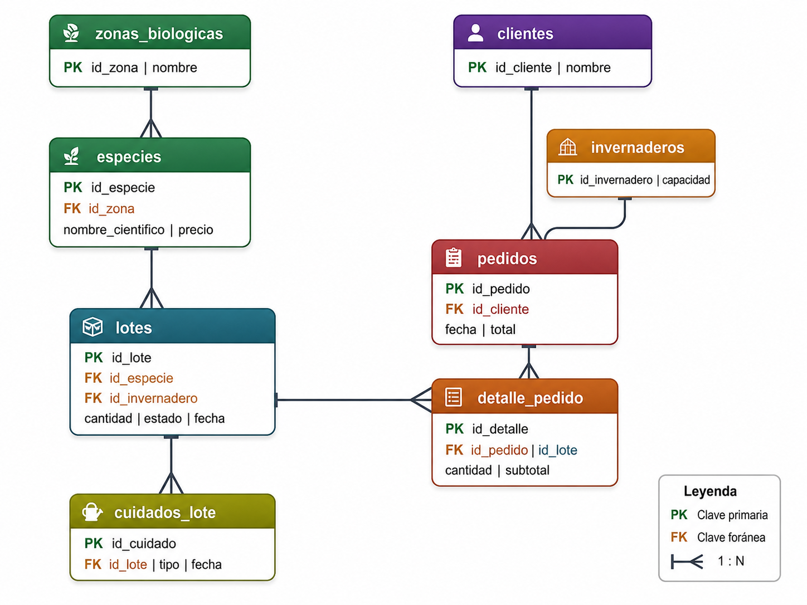
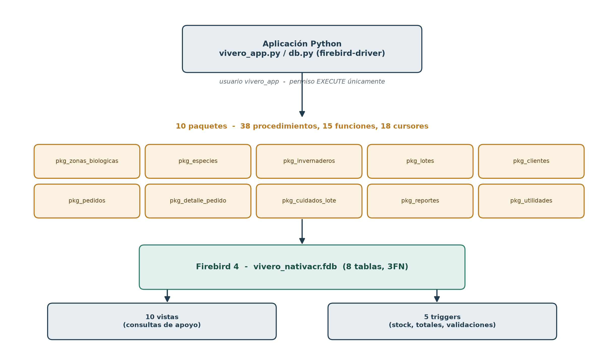

# Vivero NativaCR

Proyecto final de Lenguajes de Base de Datos (SC-504).
Universidad Fidelitas, Grupo 8.

Sistema para un vivero de plantas nativas: inventario, pedidos y cuidados por lote.

**Integrantes:** Natalia Aguero, Harvi Arias, Camilo Montero

## Organización del trabajo colaborativo

El desarrollo del proyecto se realizó de manera colaborativa mediante Microsoft
Teams. Por este medio, los integrantes distribuyeron las tareas, revisaron los
avances, analizaron la implementación de los objetos de base de datos y
tomaron decisiones técnicas en conjunto, incluida la migración del motor
MariaDB a Firebird para cumplir con el requerimiento de paquetes.

Aunque los commits del repositorio aparecen registrados bajo una única cuenta
de GitHub, esta se utilizó como cuenta centralizadora para integrar y publicar
los cambios acordados por el grupo. La autoría y revisión del contenido
corresponde a los tres integrantes, quienes participaron en la planificación,
documentación, validación y desarrollo del sistema.

| Integrante | Responsabilidades principales |
|---|---|
| Natalia Agüero Segura | Documentación, revisión de requerimientos y validación del diccionario de datos |
| Harvi Arias Peña | Administración del repositorio, integración del código y configuración de Firebird |
| Camilo Montero Moya | Revisión de procedimientos, pruebas funcionales y validación del modelo relacional |

## Contenido del repositorio

| Carpeta | Descripción |
|---------|-------------|
| `docs/` | Documentos de los avances (Word/PDF), diagramas y notas de la migración a Firebird |
| `sql/` | Esquema, datos semilla, usuario de aplicación, permisos y diccionario de datos (Firebird) |
| `sql/04_paquetes/` | Los 10 paquetes PSQL (lenguaje procedural de Firebird): procedimientos, funciones y cursores |
| `sql/mariadb_avance1/` | Scripts originales del Avance I sobre MariaDB, conservados como referencia |
| `src/` | Aplicación de consola en Python 3 (conexión y menú) |

## Diagramas

**Modelo relacional** — 8 tablas en tercera forma normal:



**Arquitectura de acceso a datos** — la aplicación solo llama procedimientos de los 10 paquetes; estos son los únicos con acceso a las tablas, vistas y triggers:



## Motor de base de datos

Desde el Avance II el proyecto usa **Firebird 4** (ver [docs/migracion-firebird.md](docs/migracion-firebird.md)
para la justificación del cambio desde MariaDB). El lenguaje de conexión sigue
siendo Python 3, tal como se definió en el Avance I.

## Instalación de la base de datos

Requiere Firebird 4 (`dnf install firebird firebird-utils` en RHEL/CentOS,
vía el repositorio EPEL). El usuario `SYSDBA` y su contraseña se configuran
al instalar el paquete; sustituir `<password_sysdba>` por ese valor en los
comandos siguientes.

```bash
DB=localhost:/var/lib/firebird/data/vivero_nativacr.fdb

isql-fb -user SYSDBA -password '<password_sysdba>' -i sql/01_schema.sql
isql-fb -user SYSDBA -password '<password_sysdba>' $DB -i sql/02_seed.sql
isql-fb -user SYSDBA -password '<password_sysdba>' $DB -i sql/03_usuario_app.sql
isql-fb -user SYSDBA -password '<password_sysdba>' $DB -i sql/06_vistas.sql
isql-fb -user SYSDBA -password '<password_sysdba>' $DB -i sql/07_triggers.sql

for f in sql/04_paquetes/*.sql; do
  isql-fb -user SYSDBA -password '<password_sysdba>' $DB -i "$f"
done

isql-fb -user SYSDBA -password '<password_sysdba>' $DB -i sql/08_permisos_app.sql
```

Diccionario de datos (equivalente a exportar desde SQL Developer, pero para Firebird):

```bash
isql-fb -user SYSDBA -password '<password_sysdba>' $DB -i sql/05_diccionario_datos.sql
```

## Ejecución del programa

```bash
cd src
pip install -r requirements.txt
cp db_config.example.py db_config.py
```

Editar `db_config.py` con la ruta de la base, el usuario `vivero_app` y su
contraseña (creada en `sql/03_usuario_app.sql`).

```bash
python test_conexion.py
python vivero_app.py
```

Toda operación de `vivero_app.py` pasa por procedimientos almacenados de los
paquetes en `sql/04_paquetes/`; el usuario `vivero_app` no tiene permisos
directos sobre las tablas (solo `EXECUTE` sobre los paquetes).

Repositorio: https://github.com/haarias-cr/vivero-nativacr-lenguajes-bd-g8
